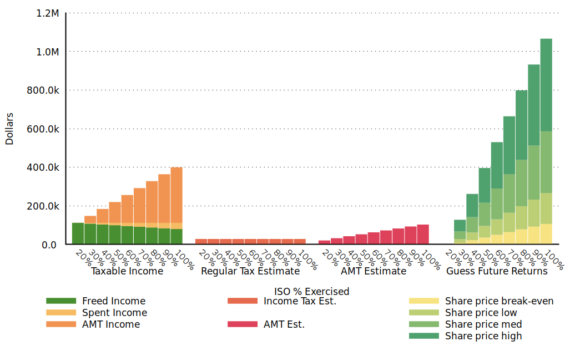

# PyAMT
Incentive stock option calculator that produces tax + guess-the-future payoff graphs and tables.


**WORK IN PROGRESS**
The values look correct and the tables and graphs look OK -- but don't look under the hood (it's ugly).

## Disclaimer

This tool does not produce financial advice.  I am not an accountant or a financial advisor and I do
not play one on TV.  This tool is for educational purposes only.  Please consult your tax advisor
before acting on any information created for you by this tool.

## Prerequisites

- prettytable
- gnuplot 5.x+

```bash
# in debian
sudo apt-get install python-prettytable gnuplot

# with pip
sudo pip install prettytable
```

## Example Usage

### Default Output

This runs with defaults equal to: ` python pyamt.py --sell=20 --shares=40000 --strikeprice=1.00 --currentprice=15.00 --fmvprice=10.00 --otherincome=80000`
```bash
$ python pyamt.py

Running gnuplot with args: gnuplot -p -e ' set datafile separator " "; set terminal wxt enhanced font "Ariel,8" persist; set border 3 front lt black linewidth 1.000 dashtype solid; set grid y; set format y "%.1s%c"; set ylabel "Dollars"; set xlabel "ISO % Exercised"; set xlabel  offset character 0, -1, 0 font "Ariel,8" textcolor lt -1 norotate; set autoscale; set style data histograms; set style histogram clustered gap 1 title textcolor lt -1 offset character 2, -0.15; set style histogram rowstacked title offset 0,1; set style fill solid noborder; set boxwidth 0.95; set xtics border in scale 0,0 nomirror rotate by -45  autojustify; set xtics norangelimit  font ",7"; set xtics (); set ytics border in scale 0,0 mirror norotate  autojustify; set ytics norangelimit autofreq  font ",8"; set ztics border in scale 0,0 nomirror norotate  autojustify; set cbtics border in scale 0,0 mirror norotate  autojustify; set rtics axis in scale 0,0 nomirror norotate  autojustify; set key bmargin center horizontal Left reverse noenhanced autotitle nobox; plot newhistogram "Taxable Income", "/tmp/tmpGNtnsV" using 2:xticlabels(1) t "Freed Income" linecolor rgb "#488f31", "" using 3 t "Spent Income" linecolor rgb "#f6bc63", "" using 4 t "AMT Income" linecolor rgb "#f19452", newhistogram "Regular Tax Estimate", "" using 5:xticlabels(1) t "Income Tax Est." linecolor rgb "#e66a4d", newhistogram "AMT Estimate", "" using 6:xticlabels(1) t "AMT Est." linecolor rgb "#de425b", newhistogram "Guess Future Returns", "" using 7:xticlabel(1) t "Share price break-even" linecolor rgb "#f7e382", "" using 8 t "Share price low" linecolor rgb "#bdcf75", "" using 9 t "Share price med" linecolor rgb "#85b96f", "" using 10 t "Share price high" linecolor rgb "#4fa16e" ; '
gnuplot output:
gnuplot err:
Tax Table
+-------------------+-------------+-------------+-------------------+-------------+------------+--------------+--------------+
| Percent Exercised | Sold Shares | Sale Income | Spent Sale Income | Shares Held | AMT Income | Tax Estimate | AMT Estimate |
+-------------------+-------------+-------------+-------------------+-------------+------------+--------------+--------------+
|        20%        |     8000    |   112000.0  |        0.0        |     0.0     |    0.0     |   28589.0    |   20878.0    |
|        30%        |     8000    |   112000.0  |       4000.0      |    4000.0   |  36000.0   |   28589.0    |   32564.0    |
|        40%        |     8000    |   112000.0  |       8000.0      |    8000.0   |  72000.0   |   28589.0    |   42644.0    |
|        50%        |     8000    |   112000.0  |      12000.0      |   12000.0   |  108000.0  |   28589.0    |   52724.0    |
|        60%        |     8000    |   112000.0  |      16000.0      |   16000.0   |  144000.0  |   28589.0    |   62804.0    |
|        70%        |     8000    |   112000.0  |      20000.0      |   20000.0   |  180000.0  |   28589.0    |   72884.0    |
|        80%        |     8000    |   112000.0  |      24000.0      |   24000.0   |  216000.0  |   28589.0    |   82964.0    |
|        90%        |     8000    |   112000.0  |      28000.0      |   28000.0   |  252000.0  |   28589.0    |   93044.0    |
|        100%       |     8000    |   112000.0  |      32000.0      |   32000.0   |  288000.0  |   28589.0    |   103124.0   |
+-------------------+-------------+-------------+-------------------+-------------+------------+--------------+--------------+

Guess-the-Future Table
+-------------------+-------------+-------------------+----------------+------------------+---------------+------------------+---------------+-------------------+----------------+
| Percent Exercised | Shares Held | Break-even Amount | Break-even PPS | Guess Low Amount | Guess Low PPS | Guess Med Amount | Guess Med PPS | Guess High Amount | Guess High PPS |
+-------------------+-------------+-------------------+----------------+------------------+---------------+------------------+---------------+-------------------+----------------+
|        20%        |     0.0     |        0.0        |      0.0       |       0.0        |      5.0      |       0.0        |      15.0     |        0.0        |      30.0      |
|        30%        |    4000.0   |       7975.0      |      1.99      |     27975.0      |      6.99     |     67975.0      |     16.99     |      127975.0     |     31.99      |
|        40%        |    8000.0   |      22055.0      |      2.76      |     62055.0      |      7.76     |     142055.0     |     17.76     |      262055.0     |     32.76      |
|        50%        |   12000.0   |      36135.0      |      3.01      |     96135.0      |      8.01     |     216135.0     |     18.01     |      396135.0     |     33.01      |
|        60%        |   16000.0   |      50215.0      |      3.14      |     130215.0     |      8.14     |     290215.0     |     18.14     |      530215.0     |     33.14      |
|        70%        |   20000.0   |      64295.0      |      3.21      |     164295.0     |      8.21     |     364295.0     |     18.21     |      664295.0     |     33.21      |
|        80%        |   24000.0   |      78375.0      |      3.27      |     198375.0     |      8.27     |     438375.0     |     18.27     |      798375.0     |     33.27      |
|        90%        |   28000.0   |      92455.0      |      3.3       |     232455.0     |      8.3      |     512455.0     |      18.3     |      932455.0     |      33.3      |
|        100%       |   32000.0   |      106535.0     |      3.33      |     266535.0     |      8.33     |     586535.0     |     18.33     |     1066535.0     |     33.33      |
+-------------------+-------------+-------------------+----------------+------------------+---------------+------------------+---------------+-------------------+----------------+
```



### Help
```bash
 python pyamt.py -h
usage: pyamt.py [-h] [--sell SELL] [--shares SHARES]
                [--strikeprice STRIKEPRICE] [--currentprice CURRENTPRICE]
                [--fmvprice FMVPRICE] [--otherincome OTHERINCOME]

optional arguments:
  -h, --help            show this help message and exit
  --sell SELL           Percentage to sell to fund acquiring more shares (must
                        be enough currently)
  --shares SHARES       Total number of shares
  --strikeprice STRIKEPRICE
                        Strike price per share
  --currentprice CURRENTPRICE
                        Current market price per share
  --fmvprice FMVPRICE   Current Fair Market Value (FMV) per share
  --otherincome OTHERINCOME
                        Other income in exercise year -- used to calculate
                        estimated taxes
```

## OSX Support
This is untested on OSX as it was developed on GNU/Linux. Please report bugs for any issues found.

```bash
brew install gnuplot --with-aquaterm --with-qt
```

Fixing fonts/rendering may require replacing the following line in `pyamt.py` in the `gnuplot_cmd_block`
variable (please report back with findings and I'll make it easier):
```
# Replace this:
set terminal wxt enhanced font "Ariel,8" persist

# With this:
set term qt enhanced font "Arial,8" persist
```

List of terminal modes supported may be helpful:
http://www.bersch.net/gnuplot-doc/complete-list-of-terminals.html

## Resources


## Credits
https://learnui.design/tools/data-color-picker.html#divergent
http://www.gnuplotting.org/
https://www.electricmonk.nl/log/2014/07/12/generating-good-looking-charts-with-gnuplot/
http://gnuplot.sourceforge.net/demo/histograms.html
